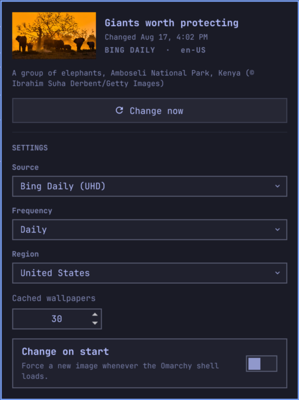

# Fresh Wallpaper

Fresh Wallpaper is a wallpaper rotation plugin for Omarchy Quattro. It downloads a random unseen image from Bing's recent daily wallpaper collection and applies it through Omarchy's native background command.

Its small bar control opens a native configuration panel. Fresh Wallpaper runs inside `omarchy-shell`, with no standalone app or separate background process. The bar control is also the plugin's on-switch, so removing or disabling it stops wallpaper rotation.



## Default behavior

- Adds a wallpaper control to the right side of the Omarchy bar.
- Downloads a UHD Bing wallpaper the first time the plugin is enabled.
- Changes the wallpaper daily.
- Schedules Daily, Weekly, and Monthly as elapsed time after the last successful change.
- Does not force another change when the Omarchy shell or plugin reloads.
- Chooses an image not used yet from Bing's current eight-day archive.
- Prefers the 3840x2160 image and falls back to 1920x1080 when UHD is unavailable.
- Starts a new random pass after all available images have been used, without immediately repeating the current image.
- Keeps the active wallpaper and caps the download cache at 30 images by default.
- Ignores one transient login failure, then shows at most one notification until an update succeeds.

## Why Bing first

Bing is the best first provider for this small plugin: it needs no API key, publishes a curated landscape image every day, supplies attribution metadata, and currently serves a 3840x2160 UHD image. Its homepage archive is not a versioned public API, so a future Bing change may require a plugin update.

Other providers can be added behind the existing `provider` setting without changing the scheduler or Omarchy integration.

## Requirements

- Omarchy 4.0 or newer
- `curl`
- `jq`
- `file`
- GNU core utilities

These commands are included in a normal Omarchy installation. No sudo or pkexec is required.

## Install

> [!IMPORTANT]
> On Omarchy 4.0.0-1, install, update, or edit plugin files only while the session is unlocked. An [upstream shell hot-reload bug](https://github.com/basecamp/omarchy/issues/7106) can strand or crash an active lock screen. Scheduled wallpaper changes are unaffected because they update cache and state files without reloading plugin code.

```sh
omarchy plugin add https://github.com/orienw/omarchy-fresh-wallpaper.git --enable
```

Enabling adds the bar control and downloads the first wallpaper. Later starts respect the Daily schedule instead of forcing another change.

## Use

Click the wallpaper icon to open the panel. The panel shows the current image and attribution, and lets you choose the source, frequency, region, cache limit, and whether to change the wallpaper when Omarchy starts. Bing Daily is the only source in version 0.1, with more providers planned. Frequency defaults to Daily, with simple Manual, Weekly, and Monthly choices alongside it.

Daily means 24 hours after the last successful wallpaper change, Weekly means 7 days, and Monthly means 30 days. **Change now** starts that interval again, so these are elapsed schedules rather than fixed calendar times.

Press **Change now** in the panel or middle-click the bar icon to apply another wallpaper immediately.

The shell commands remain available for shortcuts and automation:

```sh
omarchy-shell fresh-wallpaper refresh
```

Inspect the schedule, last result, image path, and Bing attribution:

```sh
omarchy-shell fresh-wallpaper status | jq
```

## Configure

Use the bar panel for normal configuration. Its primary frequency choices are Manual, Daily, Weekly, and Monthly. Selecting **Custom minutes...** saves a 60-minute interval and reveals the advanced field for further adjustment. You can also keep between 8 and 100 downloaded wallpapers. Every change is saved to Omarchy's native shell configuration.

Use the commands below for scripting or values not offered as presets.

Set the interval in minutes. Use `0` for manual-only rotation or a value from 15 through 525,600:

```sh
omarchy-shell fresh-wallpaper setIntervalMinutes 360
```

Choose the Bing market used for the image collection and metadata:

```sh
omarchy-shell fresh-wallpaper setMarket en-GB
```

Control whether every Omarchy shell or plugin start forces an additional wallpaper change. This is off by default; the plugin still downloads a wallpaper when no prior state exists:

```sh
omarchy-shell fresh-wallpaper setRunOnStart false
```

Set the maximum number of downloaded wallpapers retained in the cache:

```sh
omarchy-shell fresh-wallpaper setCacheLimit 30
```

The provider setting is ready for future sources. Version 0.1 supports Bing:

```sh
omarchy-shell fresh-wallpaper setProvider bing
```

These commands persist settings in the plugin's existing entry in `~/.config/omarchy/shell.json`. The equivalent entry is:

```json
{
  "id": "io.github.orienw.fresh-wallpaper",
  "provider": "bing",
  "market": "en-US",
  "intervalMinutes": 1440,
  "runOnStart": false,
  "cacheLimit": 30
}
```

## Storage and network behavior

Fresh Wallpaper makes HTTPS requests to `www.bing.com`. Redirects are restricted to HTTPS. Archive responses are capped at 2 MiB and wallpaper downloads at 50 MiB. It stores downloaded images under `${XDG_CACHE_HOME:-$HOME/.cache}/omarchy/fresh-wallpaper/` and rotation metadata under `${XDG_STATE_HOME:-$HOME/.local/state}/omarchy/fresh-wallpaper/`.

The helper validates each response as a non-empty JPEG before changing the desktop. A failed request leaves the current Omarchy background untouched.

Bing images remain copyrighted by their respective owners. Use them as personal desktop wallpapers and inspect the preserved attribution with the status command.

## Update

Update the installed plugin from its Git repository:

```sh
omarchy plugin update io.github.orienw.fresh-wallpaper
```

Omarchy shows the incoming changes before updating, validates the plugin, and reloads it. With **Change on start** left at its default Off setting, that reload keeps the current wallpaper and the existing schedule.

Run updates only while the session is unlocked until the upstream lock-screen reload bug linked in the installation section is fixed.

## Remove

```sh
omarchy plugin remove io.github.orienw.fresh-wallpaper
```

Removal stops rotation and removes the plugin checkout. Downloaded wallpapers and metadata remain so an active background never becomes a broken path. To delete them too, first select another Omarchy background, then remove these two plugin-owned directories:

```sh
rm -r -- "${XDG_CACHE_HOME:-$HOME/.cache}/omarchy/fresh-wallpaper"
rm -r -- "${XDG_STATE_HOME:-$HOME/.local/state}/omarchy/fresh-wallpaper"
```

## Develop

Validate the plugin contract and QML entry points:

```sh
omarchy plugin validate .
tests/lint-qml
```

Run the downloader and scheduler tests without network access or desktop changes:

```sh
tests/test-fetch-wallpaper
tests/test-service
```

From an active Omarchy Wayland session, smoke-test the real panel and bar widget types. The panel stays closed and no settings are changed:

```sh
tests/test-ui
```

Probe the live Bing source without changing the wallpaper:

```sh
scripts/fetch-wallpaper --provider bing --market en-US --no-apply | jq
```

## License

Fresh Wallpaper is released under the MIT License. See [LICENSE](LICENSE).
